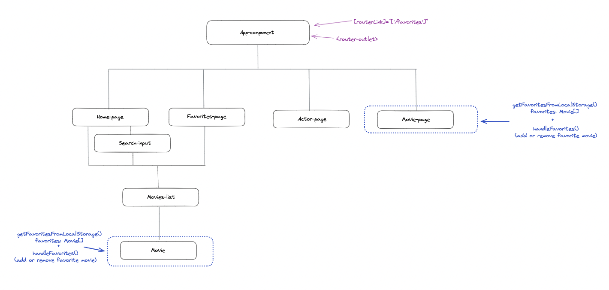

# GestFilms

This project was generated with [Angular CLI](https://github.com/angular/angular-cli) version 15.0.5.

## Development server

Run `ng serve` for a dev server. Navigate to `http://localhost:4200/`. The application will automatically reload if you change any of the source files.

## Code scaffolding

Run `ng generate component component-name` to generate a new component. You can also use `ng generate directive|pipe|service|class|guard|interface|enum|module`.

## Build

Run `ng build` to build the project. The build artifacts will be stored in the `dist/` directory.

## Running unit tests

Run `ng test` to execute the unit tests via [Karma](https://karma-runner.github.io).

## Running end-to-end tests

Run `ng e2e` to execute the end-to-end tests via a platform of your choice. To use this command, you need to first add a package that implements end-to-end testing capabilities.

## Further help

To get more help on the Angular CLI use `ng help` or go check out the [Angular CLI Overview and Command Reference](https://angular.io/cli) page.

## Consignes:

Le but de l'exercice est de :
initialiser un projet Angular avec routing intégré et css
créer les différentes pages que propose le template et mettre en place le routing
créer le service regroupant les différents appels api
gérer les favoris avec le local storage
mettre en place un formulaire de recherche dont la soumission exécute une requête api et affiche le résultat retourné
[attendu](src/assets/video/attendu.mp4)

Dans un premier temps, je vous invite à créer un compte auprès de l'api The Movie DataBase (TMDB) et obtenir une clé. Je vous donnerai plus de détails sur les requêtes principales à utiliser et les étapes à suivre pour construire ce projet.
A noter que vous pourrez le conserver et l'intégrer au sein de votre protfolio, tout comme les projets que vous avez déjà menés au cours de votre parcours :ampoule:
[API DOCS](https://developers.themoviedb.org/3/getting-started/introduction)

Voici les requêtes API à utiliser si vous souhaitez reproduire ce template :
Pour la liste des films populaires : https://api.themoviedb.org/3/movie/popular?api_key=VOTRE_CLE_API&language=fr-FR&page=1
Pour la liste des films actuellement en salle : https://api.themoviedb.org/3/movie/now_playing?api_key=VOTRE_CLE_API&language=fr-FR&page=1&region=FR
Pour la liste des films les mieux notés : https://api.themoviedb.org/3/movie/top_rated?api_key=VOTRE_CLE_API&language=fr-FR&page=1
Pour les films prochainement en salle : https://api.themoviedb.org/3/movie/upcoming?api_key=VOTRE_CLE_API&language=fr-FR&page=1&region=FR
Pour les infos d'un film via son id : https://api.themoviedb.org/3/movie/${movieId}?api_key=VOTRE_CLE_API&language=fr-FR
Pour les infos d'un acteur via son id : https://api.themoviedb.org/3/person/${actorId}?api_key=VOTRE_CLE_API&language=fr-FR
Pour avoir la liste des films dans lesquels un acteur a joué via son id : https://api.themoviedb.org/3/person/${actorId}/movie_credits?api_key=VOTRE_CLE_API&language=fr-FR
Pour avoir une liste de films à partir d'un input (champ de recherche) : https://api.themoviedb.org/3/search/movie?api_key=VOTRE_CLE_API&language=fr-FR&query=${input}&page=1&include_adult=false&region=FR
Pour récupérer la liste des acteurs d'un film via son id : https://api.themoviedb.org/3/movie/${movieId}/credits?api_key=VOTRE_CLE_API&language=fr-FR

---

Pour afficher les images fournies par l'api, il faut ajouter "https://image.tmdb.org/t/p/original/" avant la path :

En utilisant "original" dans l'url, on utilise une image avec une grande résolution. On a la possibilité d'utiliser d'autres tailles selon l'url ajoutée :
https://image.tmdb.org/t/p/w92/
https://image.tmdb.org/t/p/w154/
https://image.tmdb.org/t/p/w185/
https://image.tmdb.org/t/p/w342/
https://image.tmdb.org/t/p/w500/

Ne vous mettez pas de pression sur cet exercice, l'objectif est de continuer à réfléchir "angular" pendant cette semaine, et pas forcément le terminer avant dimanche.

## 1- Votre application contient 4 pages de navigation :

"/" : la home-page, qui va servir à afficher le formulaire de recherche (et les résultats de la recherche une fois le formulaire soumis), ainsi que la liste des films populaires, actuellement et prochainement en salle, et les mieux notés
"/movies/:movieId" : la movie-page, qui affiche les détails d'un film ainsi que la liste de ses acteurs
"/actors/:actorId" : la actor-page, qui affiche les infos d'un acteur ainsi que les films dans lesquels il a joué
"/favorites" : la favorite-page, qui liste la liste de films mis en favori
Comme vous pouvez le constater dans la video, le lien vers la page /favorites se fait depuis l'ensemble du site :clin_d'œil:
Avec ces informations, vous pouvez commencer à mettre en place le routing.
A noter que j'ai ajouté aux url de movie-page et actor-page des slugs au id. Vous pouvez faire comme nous en avons l'habitude, à savoir avec des id uniquement, je vous fournirai plus d'explications sur les slugs dans la video de correction

## 2- On va commencer avec la page d'accueil.

Créer un service api-service (comme dans la quête, pas api-service-service), et créer une méthode getPopularMovies() pour récupérer la liste des films populaires.
Dans votre composant home-page (si vous l'avez appelé comme ça), créer une méthode getPopularMoviesFromService() qui ferait appel à la méthode getPopularMovies() pour assigner le tableau de la requête à la propriété popularMovies que vous aurez créée en amont. Etant donné que nous souhaitons exécuter cette requête dès l'affichage de notre composant, il faudra appeler la méthode getPopularMoviesFromService() au sein du ngOnInit()
Côté html, vous ferez une boucle sur ce tableau pour n'afficher que le poster_path. Ne passez pas trop de temps sur le css, comme on me l'a souvent dit, "le sucre vient à la fin".
Il faudra réitérer ces étapes pour les autres listes de films (Bonus : vous remarquerez qu'en ajoutant des résultats de liste de films, vous allez réécrire du code identique côté html, essayer de factoriser le tout grâce aux composants)
Pour le formulaire de recherche, je vous invite à créer un composant search-input qu'il faudra appeler dans l'html du composant home-page. Il faudra créer une méthode dans votre api-service qui fera appel à la requête qui permet de récupérer une liste de film à partir d'un input (penser à le mettre en paramètre de la fonction). Vous l'appelerez au sein d'une méthode du search-input component, qui assignera la liste retournée à une propriété movies lors de la soumission du formulaire. Si vous avez utilisé un composant pour afficher vos listes de films, vous pouvez le réutiliser pour afficher les résultats de la recherche.

## 3- A ce niveau, hormis le css, votre page d'accueil doit être fonctionnelle. Il faudra prévoir un lien vers la page /movies/:movieId lorsque l'on clique sur l'affiche d'un film.

Lorsque l'on visite la page d'un film, la seule information le concernant est son id (que l'url affiche). Il va falloir récupérer cet id dans le composant movie-page (si vous l'avez appelé comme ça), et l'utiliser pour exécuter la requête api qui récupère les détails d'un film via son id (comme précédemment, créer la méthode dans le service et l'appeler dans le composant pour l'assigner à une propriété. Quand souhaitons-nous récupérer ces infos ? à l'affichage de la page. Il faudra donc exécuter la méthode dans le ngOnInit() ). On peut alors afficher les informations du film côté html (si vous souhaitez voir les infos contenues, pensez au console.log)
Idem pour récupérer la liste des acteurs du films, c'est le même process.

## 4- Une fois la movie-page fonctionnelle, ajouter un lien vers la page /actors/:actorId à partir du profil_path de chaque acteur.

De la même manière que pour la movie-page, il va falloir récupérer l'id de l'acteur parmi les paramètres d'url, exécuter les requetes api (infos acteur et films dans lesquels il a joué) lors de l'affichage du composant.
Ajouter un lien vers /movies/:movieId dans du clic vers l'affiche d'un film

Il nous restera les favoris à gérer avec le local storage (mettre en favoris, supprimer des favoris, récupérer la liste des favoris).

## 5- Voici un schéma qui résume la gestion des favoris avec le localStorqge.

Il permet surtout de visualiser à quel moment nous devons récupérer le tableau des favoris (getFavoritesFromLoalStorage()) et quand nous devons le mettre à jour (handleFavorites()). Ce n'est qu'une proposition, car vous n'avez peut-être pas organisé vos composants de la même manière. Vous pouvez aussi récupérer votre tableau au niveau des composants home-page et favorites et de gérer la transmission des données via les inputs. La seule obligation est de gérer l'ajout et la suppression d'un favori à partir d'un composant représentant 1 film :

